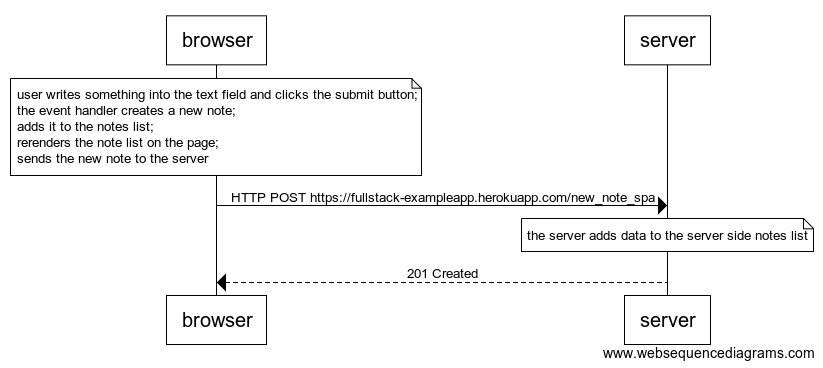

# 0.6: New note

```wsd
note over browser:
user writes something into the text field and clicks the submit button;
the event handler creates a new note;
adds it to the notes list;
rerenders the note list on the page;
sends the new note to the server
end note
browser->server: HTTP POST https://fullstack-exampleapp.herokuapp.com/new_note_spa
note over server:
the server adds data to the server side notes list
end note
server-->browser: 201 Created
```


